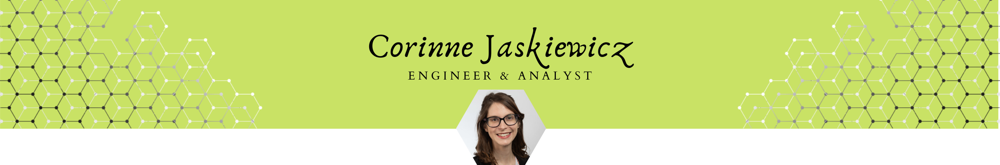

I am an experienced engineer with a demonstrated history of working in the environmental services industry. I have a strong mathematical background and proficiency in database software with a focus on analytics and visualizations. My goal is to help clients by seamlessly bridging the gap between technology and users. 

I graduated from [Cornell Unviversity](https://www.engineering.cornell.edu/) with my B.S. in Environmental Engineering in 2013. I began working as an environmental engineering consultant in Chicago in 2014. Much of my work involved permitting and compliance evaluations, and I spent most of my time running calculation in order to discover patterns. I developed a passion for not only analytics but helping clients understand their own numbers. 

After almost four years in the consulting industry, I decided to pursue my M.S. in Data Science and Analytics at [Grand Valley State University](https://www.gvsu.edu/). With this program, I have expanded my computer science background. I am an R enthusiast who enjoys developing user interfaces and testing user experiences. Examples of my UI design work is availabe under the Project link above. A copy of my short resume can also be viewed or downloaded through the link in the navigation bar above.