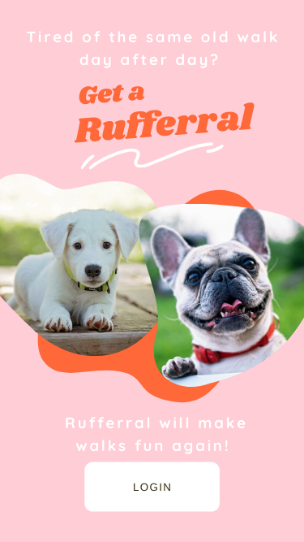
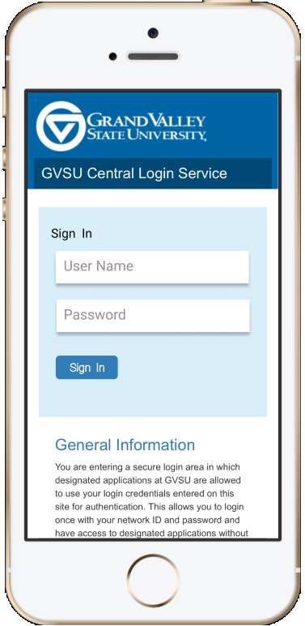

  <h2>UI Design</h2>
   
  <h4>Dog Walking App Prototype</h4>
  
The target application I proposed for an adaptive user interface was a mobile route planning application that focuses on generating walking route options for dog owners taking into account the time, weather, and location of the user. 

Rufferral provides a quick convenient way to find dog accessible routes making excursions with your pet less stressful. The app initially focuses on walking distances from your location, and provides suggested walking routes. It also takes into account the weather and time of day! On cold or rainy days, more sheltered routes will be suggested as well as identifying dog-friendly buildings and business if they are in the area. Before or after sunrise the suggested routes will focus on well lit areas for safety.

A clickable prototype is available through [figma](https://www.figma.com/proto/zgxQTCeQirQfYvhejck9r0/Project-3?node-id=1%3A2&scaling=scale-down)

   
  <h4>Class Search Interface Prototype</h4>
  
For this project, we were to build a prototype for an adaptable user interface of an annual class schedule application that provides similar functionality as the one available on the university’s website.

The interface was designed for three scenarios(young undergraduate, senior/grad student, faculty).  In general, the interface was designed to minimize scrolling and eye movement. However, in searches that generate a lot of course listings allows for vertical scrolling. The search results page minimizes information focusing on the Course offered and the available sections. The student can view more details about the course by selecting the `Details` button. Students can add their desired section straight from the search menu by clicking the `Cart` button. This is intended to minimize the number click the student is required to perform, instead of forcing them to go into the detailed panel to add the course to their cart.This whole experience was mapped to a shopping metaphor to help increase the ease of learning for students.

A clickable prototype is available through [figma](https://www.figma.com/proto/lyL1bVlHf3od6b4ujtFZDa/Project-2?node-id=6%3A19&scaling=scale-down)

